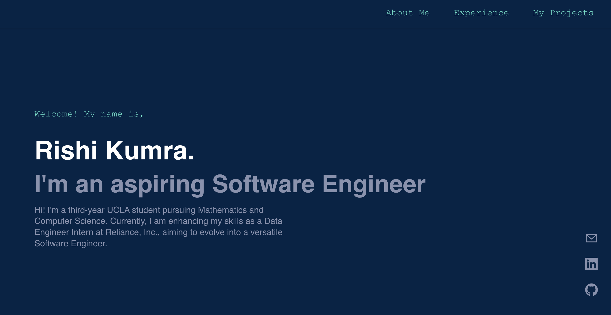

# Rishi Kumra - Personal Portfolio Website

This is my personal portfolio website, built using React, showcasing my projects, skills, and professional experience. The goal of this website is to provide an interactive and visually appealing way to learn more about my work as a software engineer, data engineer, and my passion for AI and machine learning.

### Live Demo

Check out the live version of my portfolio [here](https://rkumraUCLA.github.io).

### Preview

## Features

- **About Me:** Learn more about my background, skills, and what I am passionate about.
- **Experience:** Details of my professional journey including roles at Reliance Steel & Aluminum Co. and Simplehuman.
- **Projects:** Showcase of projects like Promptify, Slide, and other works with detailed descriptions, images, and videos.
- **Contact:** Links to my GitHub, LinkedIn, and email for easy communication.

## Tech Stack

- **Frontend:** 
  - [![React][React.js]][React-url] - For building the user interface.
  - [![JavaScript][JavaScript]][JavaScript-url] - Core programming language used.
  - [![CSS][CSS]][CSS-url] - Custom styling for a unique look and feel.

- **Libraries:** 
  - [![Framer Motion][FramerMotion]][FramerMotion-url] - For animations and transitions.
  - [![React Icons][ReactIcons]][ReactIcons-url] - For adding visual icons throughout the site.

[React.js]: https://img.shields.io/badge/React-20232A?style=for-the-badge&logo=react&logoColor=61DAFB
[React-url]: https://reactjs.org/
[JavaScript]: https://img.shields.io/badge/JavaScript-F7DF1E?style=for-the-badge&logo=javascript&logoColor=black
[JavaScript-url]: https://developer.mozilla.org/en-US/docs/Web/JavaScript
[CSS]: https://img.shields.io/badge/CSS3-1572B6?style=for-the-badge&logo=css3&logoColor=white
[CSS-url]: https://developer.mozilla.org/en-US/docs/Web/CSS
[FramerMotion]: https://img.shields.io/badge/Framer_Motion-0055FF?style=for-the-badge&logo=framer&logoColor=white
[FramerMotion-url]: https://www.framer.com/motion/
[ReactIcons]: https://img.shields.io/badge/React_Icons-61DAFB?style=for-the-badge&logo=react&logoColor=black
[ReactIcons-url]: https://react-icons.github.io/react-icons/

## License
Distributed under the MIT License. See `LICENSE.txt` for more information.

## Contact Me
Rishi Kumra: rkumra@ucla.edu

## Acknowledgements
* [README Template](https://github.com/othneildr
  
